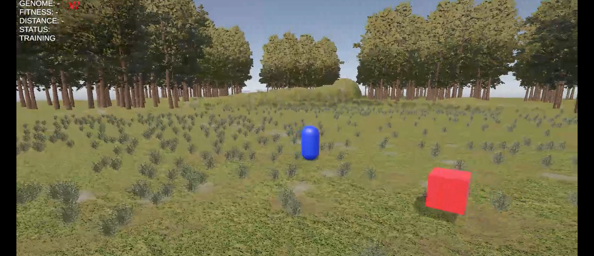
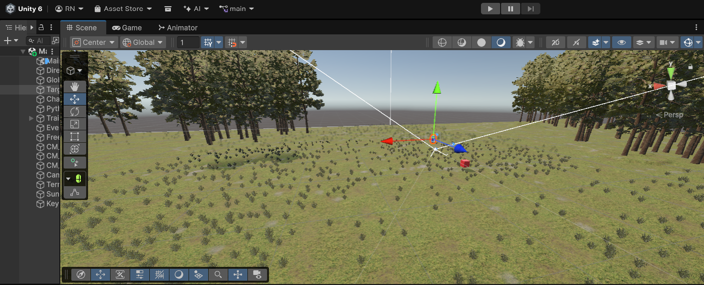

# 🧠 Unity Neural Agent

A project showcasing a **neural network-controlled agent** in a 3D Unity environment. The brain is trained in Python using NEAT (NeuroEvolution of Augmenting Topologies) and deployed in Unity for real-time visualization.


---

## 📸 Screenshots

| Training UI (Python) | Testing UI (Python) | Unity UI |
|:---:|:---:|:---:|
|  |  |  |
| Neural network training progress | Validating trained brain | Real-time agent control |

> **⚠️ Disclaimer:** The outputs and behaviors shown in these screenshots may differ from your results. This project uses **environment-based neural evolution**, meaning each training session produces unique neural networks based on random initial conditions, mutations, and environmental interactions. Your agent's behavior and performance may vary significantly from run to run.

---

## 🎯 Project Goals

- Demonstrate **neural network decision-making** in real-time
- Showcase **agent movement** in an interactive 3D environment
- Illustrate the **separation of concerns**: training in Python, simulation in Unity
- Provide an educational example of AI integration with game engines

---

## 🏗️ Project Structure

### 🎮 Unity Files

```
Assets/
├── Scenes/                      # Unity scenes
├── Scripts/
│   ├── PlayerController.cs      # Player/agent movement controller
│   ├── ChaserAgent.cs           # Neural network agent logic
│   ├── CameraDirector.cs        # Camera follow system
│   ├── NeuralNetwork.cs         # Neural network implementation
│   ├── PythonConnector.cs       # Unity ↔ Python bridge
│   ├── InputSystem.cs           # Input handling
│   └── KeyDisplay.cs            # Real-time key display UI
├── Materials/
│   ├── BlueMat.mat              # Blue material
│   ├── RedMat.mat               # Red material
│   ├── GrayMat.mat              # Gray material
│   └── Grass.mat                # Grass material
├── TerrainDemo/                 # Environment assets
├── LowlyPoly/                   # Low poly models
├── Free/                        # Free asset packs
├── TextMesh Pro/                # Text rendering
├── TutorialInfo/                # Unity tutorial data
└── Settings/                    # Project settings
```

### 🐍 Python Files

```
Python/
├── venv/                        # Python virtual environment
├── brain.py                     # Main training script
├── test_brain.py                # Testing script
├── config-feedforward.txt       # NEAT configuration
└── requirements.txt             # Python dependencies
```

### 📸 Screenshots Folder

```
screenshots/
├── training_ui.png              # Training interface screenshot
├── testing_ui.png               # Testing interface screenshot
└── unity_ui.png                 # Unity demo screenshot
```

---

## 🚀 Getting Started

### Prerequisites

- **Unity 6** or later
- **Python 3.8+**
- **pip** (Python package manager)

### 🐍 Python Setup

1. Navigate to the Python directory:
   ```bash
   cd Python/
   ```

2. Create and activate a virtual environment:
   ```bash
   python -m venv venv
   source venv/bin/activate  # On Windows: venv\Scripts\activate
   ```

3. Install dependencies:
   ```bash
   pip install -r requirements.txt
   ```

4. Train the neural network:
   ```bash
   python brain.py
   ```

5. (Optional) Test the trained brain:
   ```bash
   python test_brain.py
   ```

### 🎮 Unity Setup

1. Open the project in **Unity 6**
2. Navigate to `Assets/Scenes/` and open the main scene
3. In the Inspector, locate the agent GameObject
4. Press **Play** to start the simulation

---

## ⚙️ How It Works

### Training Phase (Python)

1. `brain.py` uses NEAT to evolve neural networks
2. Agents are evaluated based on performance metrics
3. The best-performing genome is saved as `best_genome.pkl`
4. Network configuration is stored in `config-feedforward.txt`

### Simulation Phase (Unity)

1. Unity loads the trained genome via `PythonConnector.cs`
2. `NeuralNetwork.cs` recreates the network structure
3. `ChaserAgent.cs` queries the network for decisions each frame
4. The agent moves based on neural network outputs
5. `CameraDirector.cs` follows the agent smoothly
6. `KeyDisplay.cs` shows real-time input visualization

---

## 🎨 Features

- ✅ **Real-time neural decision-making**
- ✅ **3D terrain environment** with grass, lighting, and shadows
- ✅ **HUD-style neural network visualization**
- ✅ **Non-blocking UI** positioned on the left side
- ✅ **Smooth camera follow system**
- ✅ **Low-poly aesthetic** for performance
- ✅ **Separation of training and simulation**

---

## 🧪 Controls

| Key | Action |
|-----|--------|
| **WASD** | Manual agent movement (if enabled) |
| **Space** | Toggle between manual/AI control |
| **R** | Reset agent position |
| **Esc** | Pause/Menu |

---

## 📊 Neural Network Architecture

The neural network uses a **feedforward architecture** with:

- **Input Layer**: Environmental sensors (distance, direction, obstacles)
- **Hidden Layers**: Evolved through NEAT (variable structure)
- **Output Layer**: Movement commands (forward, turn, speed)

Configuration details are in `config-feedforward.txt`.

---

## 🛠️ Customization

### Modify Training Parameters

Edit `config-feedforward.txt` to adjust:
- Population size
- Mutation rates
- Fitness thresholds
- Network topology constraints

### Change Agent Behavior

Modify `ChaserAgent.cs` to:
- Add new sensors
- Change fitness functions
- Implement different movement patterns

### Enhance Visuals

Update materials in `Assets/Materials/` or add new models to `Assets/LowlyPoly/`.

---

## 📝 Notes

- Unity is **not** used for training, only for visualization
- Training happens entirely in Python using NEAT-Python
- The `best_genome.pkl` file contains the serialized neural network
- This project is designed for **educational purposes**

---

## 🤝 Contributing

Contributions are welcome! Feel free to:

- Report bugs
- Suggest features
- Submit pull requests
- Improve documentation

---

## 📄 License

This project is licensed under the **MIT License**. See `LICENSE` for details.

---

## 🙌 Credits

**Created by:** levviii

**Technologies Used:**
- [Unity](https://unity.com/)
- [NEAT-Python](https://neat-python.readthedocs.io/)
- [TextMesh Pro](https://docs.unity3d.com/Manual/com.unity.textmeshpro.html)

---

## 📧 Contact

For questions or feedback, reach out via GitHub issues or pull requests.

---

**⭐ If you find this project useful, please consider giving it a star!**
